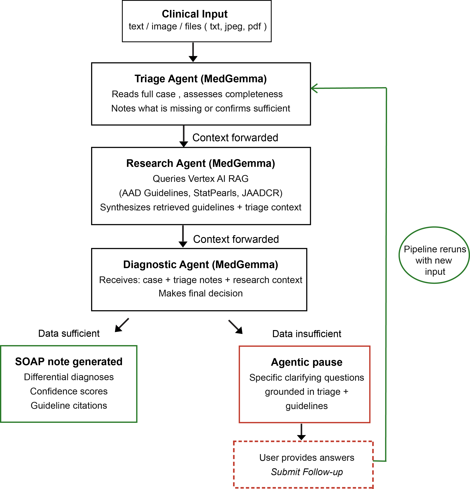

# MedGemma Clinical Robustness Assistant

A multi-agent clinical decision support system for dermatology that demonstrates diagnostic robustness under varying levels of clinical information. Built for the [Med-Gemma Impact Challenge](https://www.kaggle.com/competitions/med-gemma-impact-challenge).

The core principle: never guess when data is missing. The system pauses and asks clarifying questions instead.

---

## Architecture

Two-tier hybrid system:

**Tier 1 -- Orchestration (Google ADK + Gemini Pro)**: Manages workflow, delegates tasks, coordinates agents. Does not perform any clinical reasoning. 9 Gemini model fallbacks for API quota resilience (~900 requests/day).

**Tier 2 -- Clinical Reasoning (MedGemma on Vertex AI)**: All medical diagnosis performed by MedGemma models deployed as Vertex AI endpoints.

| Model | Parameters | Deployment |
|-------|-----------|------------|
| MedGemma-27B-IT | 27B (multimodal) | Vertex AI endpoint |
| MedGemma-4B-IT | 4B (multimodal) | Vertex AI endpoint |
| MedGemma-1.5-4B-IT | 4B (multimodal) | Vertex AI endpoint |

**Multi-Agent Workflow**:
1. Triage Agent -- checks case completeness, identifies missing data, asks clarifying questions
2. Research Agent -- retrieves clinical guidelines from Vertex AI RAG (55 documents: AAD, StatPearls, JAADCR)
3. Diagnostic Agent -- generates SOAP note with differential diagnoses and guideline citations



### Example: Multi-Agent Workflow in Action


**Complete case (diagnosis provided):**

> *Input:* "A 45-year-old woman presents with a 3-week history of an itchy, scaly, well-demarcated erythematous plaque on her right elbow. No new medications. Family history of autoimmune disease. On exam: silvery-white scale on an erythematous base, Auspitz sign positive."

| Agent | Action |
|-------|--------|
| **Triage (MedGemma)** | Missing Items: None. Case data is complete -- history, exam findings, demographics present. **Proceed.** |
| **Research (MedGemma + RAG)** | Query: "well-demarcated erythematous scaly plaque elbow Auspitz sign" -- 4 guidelines retrieved (AAD Psoriasis Guidelines, StatPearls Plaque Psoriasis). Synthesis: presentation consistent with plaque-type psoriasis given classic morphology and Auspitz sign. |
| **Diagnostic (MedGemma)** | **SOAP Note** -- Primary Dx: Plaque Psoriasis (Confidence: 0.90). Differentials: Nummular Dermatitis (0.40), Tinea Corporis (0.25). Plan: KOH prep to rule out fungal, initiate topical corticosteroid, dermatology referral. |

**Incomplete case (agentic pause):**

> *Input:* "A patient has a skin rash."

| Agent | Action |
|-------|--------|
| **Triage (MedGemma)** | Missing Items: Patient age, rash location, duration, morphology, associated symptoms. **Request Clarification.** Questions: "What is the patient's age?", "Where on the body is the rash?", "How long has it been present?" |

The workflow **pauses** -- no diagnosis attempted. This is the core safety behavior.

---

## Evaluation

750 evaluations across 3 MedGemma models, 5 context variants, and 2 data formats on the JAAD Case Reports (JDCR) dataset.

**Dataset**: JAAD Case Reports — 25 open-access (CC BY-NC-ND 4.0) dermatology case challenge cases with MCQ ground truth. Cases preprocessed from publicly available PDFs. Full reproducible pipeline included (see JAADCR Data Pipeline below).

**Context Variants** (per case): Original (complete), History only, Image only, Exam only, Exam restricted (vague)

**Key Results** — original variant (complete clinical data):

| Model | Format | Top-1 | Any-Rank |
|-------|--------|-------|----------|
| **MedGemma-1.5-4B-IT** | **with options** | **76%** | **84%** |
| MedGemma-4B-IT | with options | 64% | 76% |
| MedGemma-27B-IT | with options | 56% | 72% |
| MedGemma-1.5-4B-IT | no options | 44% | 52% |
| MedGemma-4B-IT | no options | 36% | 36% |
| MedGemma-27B-IT | no options | 28% | 52% |

**Safety behavior** (incomplete variants — missing clinical data):
- Original variant pause rate: 12–32% (system correctly diagnoses when data is complete)
- Incomplete variant pause rate: **83–100%** (system correctly refuses to diagnose with missing data)
- The gap between these two numbers is the core safety signal.

**Key patterns:**
- With MCQ options, all models improve substantially — structured choices help MedGemma focus.
- Any-Rank > Top-1, meaning correct diagnoses appear in the differential even when not ranked first.
- Best: MedGemma-1.5-4B-IT with options — **76% Top-1, 84% Any-Rank**.
- Safety behavior is consistent: 83–100% pause rate on incomplete cases across all 3 models.

---

## Setup

**Prerequisites**: Python 3.10+, Google Cloud account with Vertex AI, no local GPU required.

```bash
git clone <repo-url>
cd MedGemma
conda create -n medgemma python=3.10 && conda activate medgemma
pip install -r requirements.txt
```

Create `.env`:
```bash
GOOGLE_API_KEY=your_key              # Gemini orchestrator
GOOGLE_CLOUD_PROJECT=your_project    # Vertex AI
GOOGLE_APPLICATION_CREDENTIALS=/path/to/sa.json
RAG_BACKEND=vertex
VERTEX_RAG_LOCATION=us-west1
VERTEX_RAG_CORPUS=projects/.../locations/.../ragCorpora/...
```

Deploy MedGemma models via Vertex AI Model Garden (one-click deploy), then update endpoint IDs in `src/agents/registry.py`.

---

## Usage

```bash
# Launch Gradio UI
bash bin/run_gradio_demo.sh

# Run evaluation (test with 1 case)
python scripts/evaluate_jdcr_cases.py \
  --input JAADCR/jaadcr_input \
  --agent-model medgemma-27b-it-vertex \
  --max-cases 1

# Run full evaluation (with MCQ options)
python scripts/evaluate_jdcr_cases.py \
  --input JAADCR/jaadcr_input_with_options \
  --agent-model medgemma-vertex
```

---

## JAADCR Data Pipeline

Reproducible 4-stage pipeline for preprocessing JDCR Case Challenge PDFs into evaluation format.

**Requirements**: PyMuPDF (`pip install PyMuPDF`), Google Gemini API key.

```bash
# Step 0: Extract raw text and images from each PDF (PyMuPDF)
#   Input:  folder of MM_YYYY_JDCR.pdf files
#   Output: backup_extracted/ — one subfolder per PDF with text/ and images/ inside
python scripts/jdcr_data_downlaod_preprocess/stage_0_extract_pdf_text_images.py \
  --input ./pdf_input \
  --output ./backup_extracted

# Step 1: Structure raw text into evaluation variants using Gemini API
#   Input:  backup_extracted/ (output of Step 0)
#   Output: jaadcr_input/ and jaadcr_input_with_options/ (text variants + images)
#           case_metadata/ (per-case JSON with MCQ ground truth)
python scripts/jdcr_data_downlaod_preprocess/stage_1_extract_and_split.py \
  --extracted-dir ./backup_extracted \
  --output-dir ./output

# Step 2: Build ground truth CSV from metadata
#   Input:  case_metadata/ (output of Step 1)
#   Output: JAADCR_Groundtruth.csv
python scripts/jdcr_data_downlaod_preprocess/stage_2_build_ground_truth.py \
  --metadata-dir ./output/case_metadata \
  --output-csv ./output/JAADCR_Groundtruth.csv

# Step 3: Evaluate with MedGemma
#   Input:  jaadcr_input/ or jaadcr_input_with_options/ (output of Step 1)
python scripts/evaluate_jdcr_cases.py \
  --input ./output/jaadcr_input \
  --agent-model medgemma-27b-it-vertex
```

**What each step produces:**

| Step | Script | Input | Output |
|------|--------|-------|--------|
| 0 | `stage_0_extract_pdf_text_images.py` | PDF folder | `backup_extracted/{case}/text/*.txt` + `images/*.jpeg` |
| 1 | `stage_1_extract_and_split.py` | `backup_extracted/` | `jaadcr_input/` + `jaadcr_input_with_options/` + `case_metadata/` |
| 2 | `stage_2_build_ground_truth.py` | `case_metadata/` | `JAADCR_Groundtruth.csv` |
| 3 | `evaluate_jdcr_cases.py` | `jaadcr_input/` | Evaluation JSON + Markdown summary |

---

## Technology Stack

| Component | Technology |
|-----------|-----------|
| Agent Framework | Google ADK |
| Clinical Reasoning | MedGemma-27B-IT, 4B-IT, 1.5-4B-IT (Vertex AI) |
| Orchestration | Gemini Pro (9-model fallback) |
| RAG | Vertex AI RAG (55 documents, text-embedding-005) |
| UI | Gradio 6.x |
| Knowledge Base | AAD Guidelines, StatPearls, JAADCR Case Reports |

---

## Acknowledgments

- **JAAD Case Reports** (Elsevier, CC BY-NC-ND 4.0) — evaluation dataset and knowledge base source
- **American Academy of Dermatology (AAD)** — clinical guidelines used in RAG knowledge base
- **StatPearls** (NCBI) — clinical reference material used in RAG knowledge base
- **NEJM Image Challenge** — exploratory evaluation benchmark used during development (© NEJM, educational use only; not distributed or included in this repository)
- **Google MedGemma** — medical foundation models (HAI-DEF collection)
- **Google ADK, Vertex AI** — agent framework and cloud infrastructure

---

Last Updated: February 22, 2026
